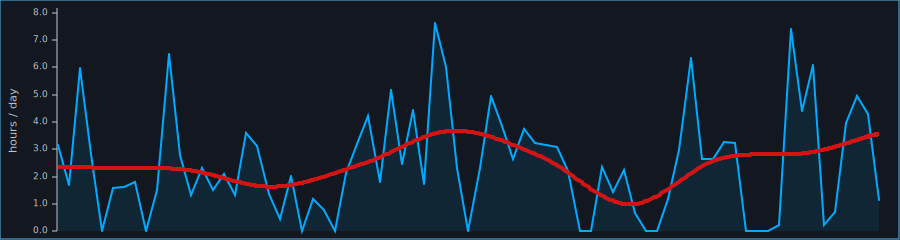

# BLAZECTL

> A minimal, fast, CLI-based time tracker for disciplined solo work.
    Run `start` / `stop` commands, store logs in JSONL, auto-generate README stats,
    and track your **Train** and **Battle** hours with streaks and activity charts.

## Field Report

- **Updated (UTC):** 2026-01-09T02:08:12.137336082Z
- **All-time (Total):** 774h 29m
- **All-time (Train):** 754h 37m
- **All-time (Battle):** 19h 51m

## Per-tag (last 30d)
- Train: 95h 52m
- Battle: 19h 51m

## Daily (last 7 days)
| Date       | Train | Battle | Total |
|------------|-------|--------|-------|
| 2026-01-03 | 3h 54m | 0h 00m | 3h 54m |
| 2026-01-04 | 6h 18m | 0h 00m | 6h 18m |
| 2026-01-05 | 4h 21m | 0h 00m | 4h 21m |
| 2026-01-06 | 3h 39m | 6h 19m | 9h 59m |
| 2026-01-07 | 0h 49m | 2h 21m | 3h 11m |
| 2026-01-08 | 2h 43m | 0h 00m | 2h 43m |
| 2026-01-09 | 0h 00m | 1h 54m | 1h 54m |

## Activity Graph

(Total hours per day for the last 75 days)

## Installation
1. **Install Rust**
   ```bash
   curl --proto '=https' --tlsv1.2 -sSf https://sh.rustup.rs | sh
   ```
2. **Clone the repository**
   ```bash
   git clone https://github.com/0xh4ty/blazectl.git
   cd blazectl
   # Remove any old tracking data
   rm -rf ~/.blaze
   ```
3. **Build and install**
   ```bash
   cargo install --path .
   ```

## Usage
Start/stop sessions:
```bash
blazectl start train
blazectl stop  train
blazectl start battle
blazectl stop  battle
```
Other commands:
```bash
blazectl status
blazectl render-readme
```
Data is stored in `.blaze/track-YYYY-MM.jsonl` (UTC timestamps, ISO-8601 durations).
Configure keybindings externally (WM/OS).

## License
BLAZECTL is open-source under the [MIT License](LICENSE).

---

Generated by **blazectl v0.1.0**.
Created by [0xh4ty](https://github.com/0xh4ty) for fellow warriors.
