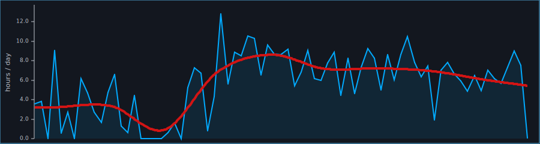

# BLAZECTL

> A minimal, fast, CLI-based time tracker for disciplined solo work.
    Run `start` / `stop` commands, store logs in JSONL, auto-generate README stats,
    and track your **Train** and **Battle** hours with streaks and activity charts.

## Field Report

- **Updated (UTC):** 2025-11-01T04:43:17.821834857Z
- **All-time (Total):** 439h 37m
- **All-time (Train):** 439h 37m
- **All-time (Battle):** 0h 00m

## Per-tag (last 30d)
- Train: 200h 31m
- Battle: 0h 00m

## Daily (last 7 days)
| Date       | Train | Battle | Total |
|------------|-------|--------|-------|
| 2025-10-26 | 7h 02m | 0h 00m | 7h 02m |
| 2025-10-27 | 6h 12m | 0h 00m | 6h 12m |
| 2025-10-28 | 5h 40m | 0h 00m | 5h 40m |
| 2025-10-29 | 7h 22m | 0h 00m | 7h 22m |
| 2025-10-30 | 9h 01m | 0h 00m | 9h 01m |
| 2025-10-31 | 7h 31m | 0h 00m | 7h 31m |
| 2025-11-01 | 0h 06m | 0h 00m | 0h 06m |

## Activity Graph

(Total hours per day for the last 75 days)

## Installation
1. **Install Rust**
   ```bash
   curl --proto '=https' --tlsv1.2 -sSf https://sh.rustup.rs | sh
   ```
2. **Clone the repository**
   ```bash
   git clone https://github.com/0xh4ty/blazectl.git
   cd blazectl
   # Remove any old tracking data
   rm -rf ~/.blaze
   ```
3. **Build and install**
   ```bash
   cargo install --path .
   ```

## Usage
Start/stop sessions:
```bash
blazectl start train
blazectl stop  train
blazectl start battle
blazectl stop  battle
```
Other commands:
```bash
blazectl status
blazectl render-readme
```
Data is stored in `.blaze/track-YYYY-MM.jsonl` (UTC timestamps, ISO-8601 durations).
Configure keybindings externally (WM/OS).

## License
BLAZECTL is open-source under the [MIT License](LICENSE).

---

Generated by **blazectl v0.1.0**.
Created by [0xh4ty](https://github.com/0xh4ty) for fellow warriors.
